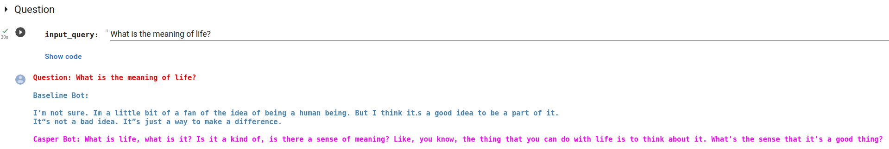

# Casper

## Run

```bash
python -m venv .venv
source .venv/bin/activate
pip install -r requirements.txt
python -m ipykernel install --user --name=casper
```

# Sample Conversation

5 epochs on a small data sample

<p align="center">
    
</p>