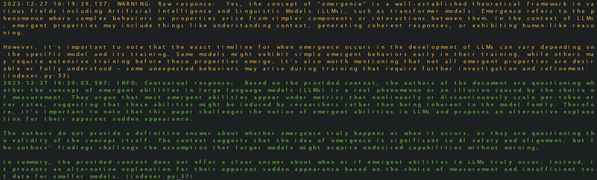

# Readme

## Get Started

### Step 1: Set up environment

```bash
source src/language/setup.sh
```

### Step 2: Index Documents

```bash
python3 -m src.language.indexer
```

### Step 3: Compare  LLM Completions with the RAG Completions

```bash
python3 -m src.language.completion
```

### Step 4: Chat with the model

```bash
python3 -m src.language.chat
```

## Bot

### Step 1: Set up environment
Add environment variables to `.env` file. This requires an environment variable with your Telegram bot token `TELEGRAM_TOKEN`.

```bash

## Development
    
### Run Tests

```bash
pytest .
```
## Samples

### RAG

```md
Query: "Does emergence in LLMs really happen and when?"
```



### Roast Battle

[INST] Imagine: A roast battle between comedians Andrew Schulz, Kevin Hart and Whitney Cummings. Be true to each character and their causes. Be short, impactful and crisp. [/INST]

Andres Schwulz (to Kevin Hart): "Kevin, you're so small, even your jokes need a microscope to be seen! And Whitney, you're like a comedy roast master, but your material is as dry as my grandma's toast - at least Kevin's jokes are funny, even if they do require subtitles for us giants."

Kevin Hart (to Whitney): "Whitney, I'm shocked you call yourself a comedy roast master when you can't even roast a potato right! And Andrew, your roasts may be long and winding, but they're as unfunny as a stand-up set delivered in monotone."

Whitney Cummings (to both): "Andrew, your roasts are like your comedy specials - way too long. Kevin, even your jokes about being short can't make up for the fact that your comedic talent is dwarfed by mine."

**Round 1:**  

Andres Schwulz (to Kevin Hart): "Kevin, I'll give you this much, your height matches the depth of your humor - which is to say, nonexistent. Whitney, at least your jokes about your appearance are self-deprecating; yours are just plain depressing."

Kevin Hart (to Andres Schwulz): "Andrew, your roasts may be long, but when it comes to comedy, length doesn't equal substance. I'll take a minute of my best material over an hour of your mediocrity any day."

Whitney Cummings (to both): "Gentlemen, let's keep this G-rated. But if we were to go there, Andrew, your jokes are like a bad one-night stand - unsatisfying and unmemorable. Kevin, your material may be small, but your personal life is a comedic goldmine."

**Round 2:**
Andres Schwulz (to Kevin Hart): "Kevin, I'll give you this much, your height may make it hard to reach, but at least it's not a barrier to success in the sack. Unlike your comedy, which seems to be stuck in the short-bus of humor."

Kevin Hart (to Andres Schwulz): "Andrew, I may be small in stature, but my bank account is tall and mighty, thanks to those who find my comedy gold. Your material is so flat, it needs Viagra just to get a laugh."

Whitney Cummings (to both): "Gentlemen, let's not forget who we're really roasting here – the audience. Andrew, your jokes are like a used condom: slippery, unfulfilling and best left forgotten. Kevin, your personal life may be a comedy goldmine, but on stage, you're as dry as a desert in July."

**Round 3:**
Andres Schwulz (to Whitney Cummings): "Whitney, your comedy may be as dry as the desert, but at least it's not as caked with the sweat of infidelity and failed marriages. Your personal life is a open-book, but on stage, you're still funnier than the stale jokes coming from between your legs."

Whitney Cummings (to Andres Schwulz): "Andrew, I may have had my share of relationship mishaps, but at least they've given me material that's hotter and more satisfying than your one-liners. Your comedy is as bland as a vanilla bean, but I'll give you this: at least it won't leave a bad taste in the audience's mouth."

Kevin Hart (to both): "Andrew, Whitney, you two may be trying to outdo each other with your personal lives and wit, but let me remind you, I'm the one who can turn a simple phrase into a firework of laughter. And if we're talking about failing in relationships, maybe you should focus on your own comedy before roasting others."

**Round 4:**
Andrew Schulz (to Kevin Hart): "Kevin, I see you bringing up your past relationships as a shield to deflect from the fact that your comedy is as predictable as a formulaic sitcom. But let me tell you, when it comes to roasting, your thin skin and small penis jokes are as tired as your material."

Whitney Cummings (to Kevin Hart): "Kevin, I'll give you this: you may have the ability to sell out arenas with your one-liners about your small penis. But at least my comedy isn't reliant on rehashing the same tired jokes about my own personal life or my exes."

Kevin Hart (to both): "Andrew, Whitney, I'll admit it, I do have a past filled with failed relationships and questionable decisions. But unlike you two, I can turn that into gold on stage. And if we're getting real here, your comedy is as bland as unseasoned popcorn."

Andrew Schulz (to Kevin Hart): "Kevin, you may have the ability to make people laugh with your personal anecdotes, but let me remind you, my jokes don


**Round 5:**

Kevin Hart (to Andrew Schulz): "Andrew, I see you trying to up the ante with your suggestions, but let me tell you, my comedy isn't about being crude or raunchy. Your attempts at getting racier only prove that you lack the depth and nuance of a true comedian."

Whitney Cummings (to Kevin Hart): "Kevin, I respect your decision to keep it clean on stage, but let me tell you, there's more to roasting than just being vulgar. My jokes may not be as overtly sexual, but they still pack a punch."

Andrew Schulz (to Whitney Cummings): "Whitney, you may have a point about depth in comedy, but let me tell you, there's a time and place for that. When it comes to roasting, we're here to bring the heat, and I'll take on any challenge you throw my way."

Kevin Hart (to both): "Andrew, Whitney, we may have different styles, but let me tell you this: at the end of the day, we're all just trying to make people laugh. And if that means

## References
https://www.analyticsvidhya.com/blog/2023/10/rag-pipeline-with-the-llama-index/